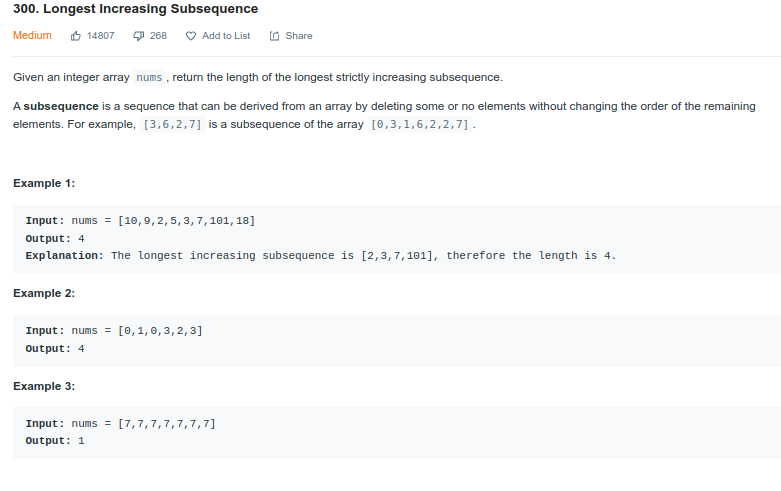
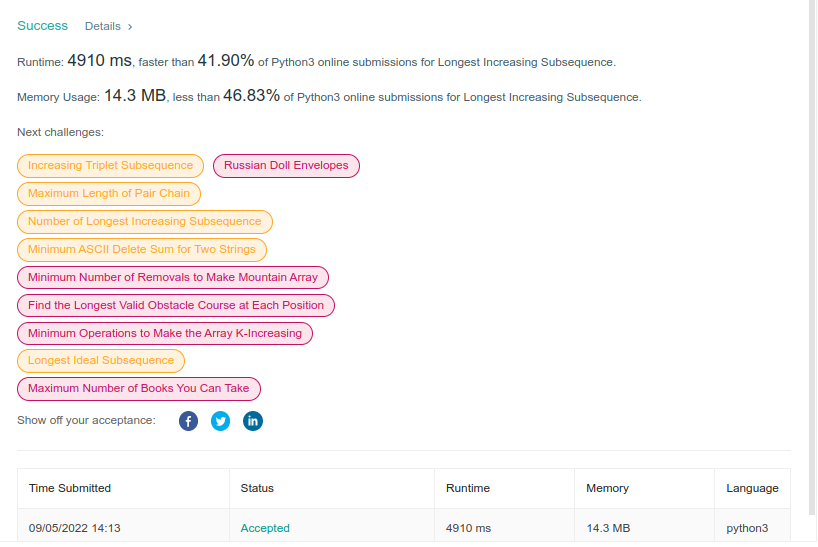
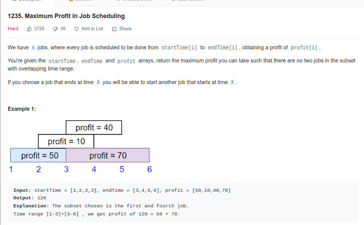

# PD_ExerciciosResolvidos

**Número da Lista**: 04 
**Conteúdo da Disciplina**: PD 

## Alunos
|Matrícula | Aluno |
| -- | -- |
| xx/xxxxxx  |  xxxx xxxx xxxxx |
| 18/0052616  |  Estevão de Jesus Reis |

## Sobre 
Nessa entrega nós resolvemos exercícios envolvendo programação dinâmica 

## Screenshots
### Longest Increasing Subsequence
#### Descrição

#### Resultado

### Maximum Profit in Job Scheduling
#### Descrição

#### Resultado

## Instalação 
**Linguagem**: Python 
Acesse o site `leetcode.com`
## Uso 
Para submeter os exercicios é preciso acessar os seguintes links:

   * Longest Increasing Subsequence: https://leetcode.com/problems/longest-increasing-subsequence/

   * Maximum Profit in Job Scheduling: https://leetcode.com/problems/maximum-profit-in-job-scheduling/

## Outros
